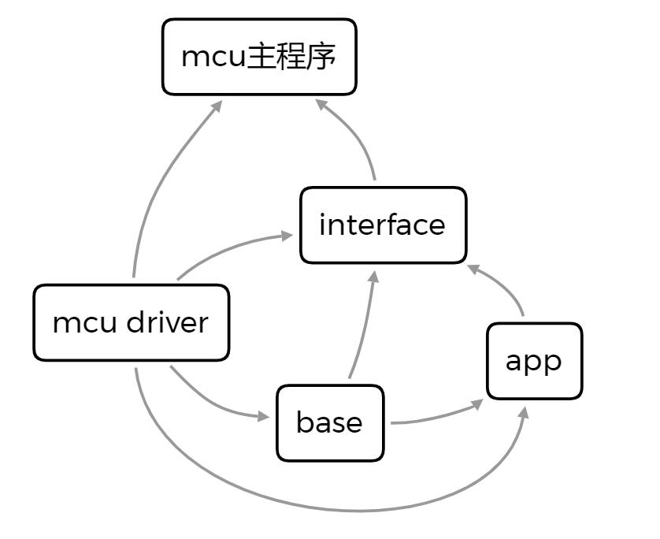

# SJTU Robomaster电控框架（2023版）

## 基本说明

本项目为上海交通大学Robomaster交龙战队电控代码框架（2023版），基于STM32CubeMX(HAL库)和FreeRTOS开发。框架主体基本兼容Robomaster开发板A型（STM32F427）和C型（STM32F407），可以经过简单修改迁移到其他MCU，支持不同IDE（MDK-ARM/CLion/VSCode）跨平台（Windows/Linux）编译调试。

## 框架架构

框架目录结构如下

```txt
RM_frame
├─.backup ----备份文件目录（如修改过的驱动源码）
│  ├─.vscode ---------VSCode配置文件备份
│  ├─freertos --------FreeRTOS源码备份
│  └─usb_cdc ---------USB驱动源码备份
├─.config ----配置文件（烧写，调试等）
│  ├─serial_studio ---Serial Studio调式配置文件
│  └─openocd.cfg -----OpenOCD烧写配置文件
├─.vscode ----VSCode项目配置文件
├─app --------具体功能应用的代码，如控制，底盘，云台等
├─base -------框架基本功能包
│  ├─bsp -------------板载外设驱动
│  ├─cap_comm --------电容
│  ├─common ----------常用函数/通用功能包/算法实现
│  ├─cv_comm ---------电控视觉通信
│  ├─imu -------------IMU
│  ├─motor -----------电机
│  ├─referee_comm ----裁判系统
│  ├─remote ----------遥控器
│  └─servo -----------舵机
├─build ------编译生成路径
├─doc --------说明文档
├─interface --框架到MCU驱动的接口程序
├─lib --------外部库
│  └─arm_math
└─mcu --------不同MCU对应的驱动源码和Cube/Keil工程文件
   ├─stm32f407
   │   ├─Drivers
   │   ├─gcc
   │   ├─Inc
   │   ├─MDK-ARM
   │   ├─Middlewares
   │   └─Src
   └─stm32f427
```

框架代码各模块的依赖关系如下

<center>

</center>

## 开发指南

### 1 开发软件

**STM32CubeMX**是ST意法半导体公司近几年来大力推荐的STM32芯片图形化配置工具，目的是让开发者通过图形化向导生成C初始化代码和底层驱动代码，可以明显程度提高开发效率。本框架使用STM32CubeMX进行硬件相关的配置。

**Keil**是目前STM32单片机开发最主流的开发工具，是一个包括编译器、宏汇编、链接器、库管理和一个功能强大的仿真调试器等在内的集成开发环境（IDE）。Keil内置的调试器实时更新数据的watch窗口，查看寄存器等功能并没有比较好的替代品，并且网上大部分有关STM32等单片机的资料都是使用Keil开发的，因此建议所有电控特别是刚入门单片机开发的队员熟悉Keil的基本使用方法。

Keil的代码编辑和项目构建体验一般，存在代码编辑效率低，易崩溃，编码格式混乱等问题。此外Keil不支持Windows以外的系统，对于个别有Linux系统下电控+视觉开发调试需求的同学或使用MacOS系统的同学不太友好。因此了解基本的嵌入式开发知识和熟悉Keil调试操作后可改用其他更强大的代码开发工具（例如**VSCode**，**CLion**）进行编辑。配置方法可参考以下资料

- [CLion-STM32开发](https://zhuanlan.zhihu.com/p/145801160)
- [VSCode-STM32开发（4篇）](https://zhuanlan.zhihu.com/p/61519415)
- [STM32CubeMX Makefile详解](https://blog.csdn.net/qwe5959798/article/details/112367495)

### 2 代码编译与调试

#### 2.1 Keil编译配置

ARM Compiler:

```text
Use default compiler version 6  
Use MicroLIB
```

define:

```text
USE_HAL_DRIVER,
STM32F407xx, # C板
STM32F427xx, # A板
ARM_MATH_CM4,
ARM_MATH_MATRIX_CHECK,
ARM_MATH_ROUNDING,
__FPU_USED=1U,
__FPU_PRESENT=1U
```

include path:

```text
..;
../../..;
../Inc;
../Drivers/STM32F4xx_HAL_Driver/Inc;
../Drivers/STM32F4xx_HAL_Driver/Inc/Legacy;
../Drivers/CMSIS/Device/ST/STM32F4xx/Include;
../Drivers/CMSIS/Include;
../Middlewares/Third_Party/FreeRTOS/Source/include;
../Middlewares/Third_Party/FreeRTOS/Source/CMSIS_RTOS;
../Middlewares/Third_Party/FreeRTOS/Source/portable/RVDS/ARM_CM4F;
```

其中"../../.."为框架根目录。

可能遇到的编译问题

- CubeMX生成代码后使用Keil编译FreeRTOS大量报错
  
> 原因是CubeMX使用的FreeRTOS版本RVDS的port文件不支持ARM compiler6编译。一种解决方式是使用GCC的port文件替换RVDS的文件，参考[FreeRTOS ARM compiler6编译报错解决方法](https://blog.csdn.net/u010058695/article/details/112485056)；另一种解决方式是使用更新版本的FreeRTOS源码中的RVDS的文件替换。本框架采用后一种解决方法，具体操作方法参考[FreeRTOS大量报错处理](.backup/freertos//README.txt)。

#### 2.2 VSCode/CLion

VSCode/CLion可通过CMake+arm-none-eabi-gcc编译工具+OpenOCD管理/编译/下载项目，具体自行学习CMake相关知识，阅读软件配置的参考资料和框架的CMakeLists.txt文件。

CMake根据CMakeLists.txt文件中的mcu变量配置选择编译的代码对应的MCU型号，编译前请确认框架根目录下CMakeLists.txt中mcu类型是否正确配置。

```cmake
set(mcu "stm32f407") # C板
set(mcu "stm32f427") # A板
```

编译命令：

Windows

```cmd
cd build
cmake .. -G "MinGW Makefiles" -DCMAKE_BUILD_TYPE=RelWithDebInfo
mingw32-make -j
```

Linux

```cmd
cd build
cmake .. -DCMAKE_BUILD_TYPE=RelWithDebInfo
make -j
```

下载/烧录命令（以stlink为例）：

```cmd
openocd -f interface/stlink.cfg -f target/stm32f4x.cfg -c 'program RM_frame.elf verify reset exit'
```

### 3 代码风格与规范

保持良好的代码习惯，功能逻辑尽量简明高效，变量、函数命名清晰，可读性好，易维护。多写注释，中文使用utf-8编码（keil默认为GB2312编码，需手动修改）。

代码风格方面本框架编写时主要参照了[Google C++风格指南](https://zh-google-styleguide.readthedocs.io/en/latest/google-cpp-styleguide/contents/)，[Google C++代码规范](https://blog.csdn.net/freeking101/article/details/78930381)。建议编写代码时风格与框架保持基本一致。

### 4 版本管理

使用git管理代码版本，提交代码时注明修改内容。可参考[Git常用命令](https://www.runoob.com/note/56524)，[Git commit格式](https://zhuanlan.zhihu.com/p/182553920)。

## 资料

1. [A板资料](https://www.robomaster.com/zh-CN/products/components/general/development-board)
2. [A板例程](https://github.com/RoboMaster/DevelopmentBoard-Examples)
3. [C板资料](https://www.robomaster.com/zh-CN/products/components/general/development-board-type-c/info)
4. [C板例程](https://github.com/RoboMaster/Development-Board-C-Examples)
