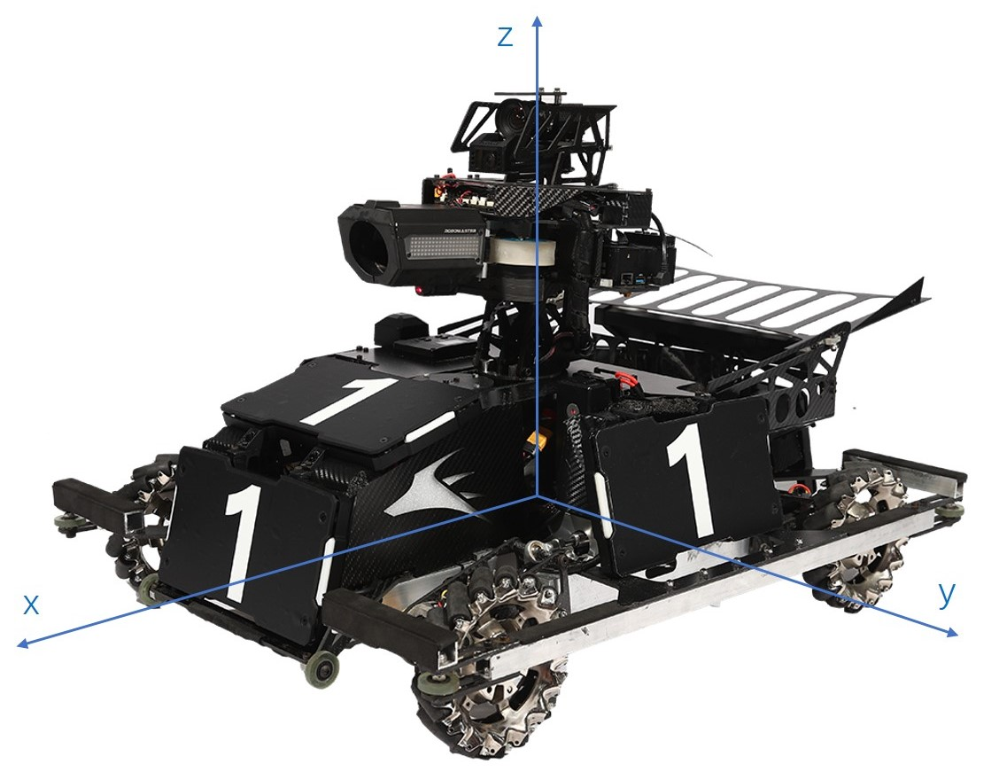

# 云台、底盘坐标系定义文档

## 云台坐标系

<center>

</center>

云台使用Z-Y'-X''欧拉角，正方向由坐标轴方向通过右手定则确定，第一视角云台向左为yaw正方向，向下为pitch正方向，注意与航空航天领域一般对欧拉角正方向的定义区分。遥控器控制代码示例如下：

```c++
gimbal.addAngle(-rc.channel_.l_row * rc_gimbal_rate,  
                -rc.channel_.l_col * rc_gimbal_rate);
```

## 底盘坐标系

<center>

</center>

底盘坐标系采用ros对于移动机器人坐标系的定义方式，即向前为x轴正方向，向左为y轴正方向，向上为z轴正方向。遥控器控制代码示例如下：

```c++
chassis.setSpeed(rc.channel_.r_col * rc_chassis_speed_rate,
                 -rc.channel_.r_row * rc_chassis_speed_rate, 
                 -rc.channel_.l_row * rc_chassis_rotate_rate);
```

当机器人坐标系方向由云台确定时，底盘还需额外进行一次坐标变换，使速度方向与云台朝向对应，具体可参考chassis.cpp内代码。

相关资料：[麦克纳姆轮底盘运动学](https://www.guyuehome.com/8392)
