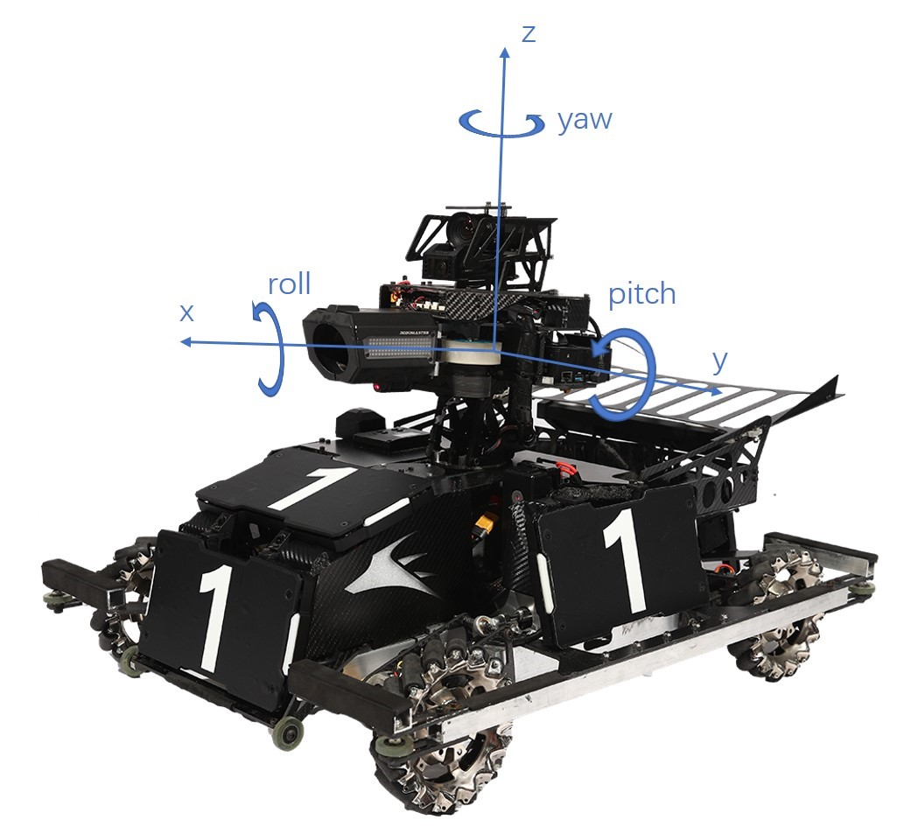

# imu程序说明文档

本文档主要介绍imu应用相关的参数设置和数据读取。IMU类为imu的抽象。在imu_monitor文件中定义程序中用到的所有imu实例，配置参数，并统一管理传感器初始化和姿态更新。

## 数据获取

IMU类定义以下成员函数用于获取位姿状态数据

```c++
float& yaw(void)
float& pitch(void)
float& roll(void)
float& quat(uint8_t i)
float& wxSensor(void)
float& wySensor(void)
float& wzSensor(void)
float& wxWorld(void)
float& wyWorld(void)
float& wzWorld(void)
float& axSensor(void)
float& aySensor(void)
float& azSensor(void)
float& axWorld(void)
float& ayWorld(void)
float& azWorld(void)
```

## 坐标系、欧拉角定义

代码中的yaw-pitch-roll欧拉角实际为Z-Y'-X''欧拉角，正方向由坐标轴方向通过右手定则确定，注意与航空航天领域一般对欧拉角正方向的定义区分。使用该定义是为了统一坐标系，使姿态角使用的坐标系与世界坐标系、底盘坐标系保持一致。网上不同资料对于yaw-pitch-roll姿态角的方向定义非常杂乱，建议参考[维基百科](https://en.wikipedia.org/wiki/Euler_angles)中的定义。

A板和C板imu传感器坐标系：
<center>

</center>

云台坐标系：
<center>

</center>

由于遥控器输入信号是按航模对于姿态角正方向的定义设计的，因此使用Z-Y'-X''欧拉角作为反馈，通过遥控器和鼠标控制云台、底盘旋转时需要添加一个负号，使遥控器摇杆或鼠标向右时（输入信号为正）云台底盘第一视角向右旋转（旋转方向为负）。遥控器控制代码示例如下：

```c++
gimbal.addAngle(-rc.channel_.l_row * rc_gimbal_rate,
                -rc.channel_.l_col * rc_gimbal_rate);
chassis.setSpeed(rc.channel_.r_col * rc_chassis_speed_rate,
                -rc.channel_.r_row * rc_chassis_speed_rate,
                -rc.channel_.l_row * rc_chassis_rotate_rate);
```

## 参数设置

板载imu相关配置参数说明

base/imu/imu_monitor.cpp

```c++
namespace boardimu {

板载IMU传感器初始化函数，在imuInitAll中调用
void initSensor(imu::RawData_t& raw_data);

板载imu传感器数据读取函数，赋值给imu实例的void (*readSensor)(imu::RawData_t&)函数指针
void readSensor(imu::RawData_t& raw_data);

传感器开关
const bool bmi088_enabled = true;
const bool ist8310_enabled = false;
const bool mpu6500_enabled = true;

imu参数
struct Param {
  // 姿态解算算法更新周期
  const float dt = 1e-3f;
  // Mahony算法加速度计（重力）融合系数
  const float kg = 5e-3f;
  // Mahony算法磁力计融合系数
  const float km = 0;

  // 传感器方向变换矩阵，根据坐标系定义和主控板的安装方向设置
  const float R_imu[3][3] = {{1.0f, 0.0f, 0.0f},
                             {0.0f, 1.0f, 0.0f},
                             {0.0f, 0.0f, 1.0f}};
  const float R_mag[3][3] = {{0.93f, 0.0f, 0.0f},
                             {0.0f, 1.03f, 0.0f},
                             {0.0f, 0.0f, 1.0f}};

  // 预先校准的传感器偏移量（若偏移量不固定则需开机校准）
  const float gyro_bias[3] = {2.6e-3f, 3e-4f, 3.5e-4f};
  const float accel_bias[3] = {0, 0, 0};
  const float mag_bias[3] = {-13.0f, -0.5f, 30.0f};
} param;

// 板载imu温度控制（基本不用调）
imu::TempControl temp(BOARD_IMU_HEAT_TIM, BOARD_IMU_HEAT_CHANNEL,
                      PID(5000, 0, 0, 500, 5000));

// 板载imu实例，构造时输入参数
IMU board_imu(boardimu::param.dt, boardimu::param.kg, boardimu::param.km,
              boardimu::param.R_imu, boardimu::param.R_mag,
              boardimu::param.gyro_bias, boardimu::param.accel_bias,
              boardimu::param.mag_bias, &boardimu::readSensor);

// 开机校准设置
// @euler_deg_init: 初始欧拉角
// @is_calibrated: 是否已完成校准（false-开机校准）
// @calibrate_time_ms: 开机校准时长（ms）
void IMU::init(EulerAngle_t euler_deg_init, bool is_calibrated, uint16_t calibrate_time_ms = 0);

}  // namespace boardimu
```

## Mahony姿态解算算法

在原本Mahony姿态解算算法的基础上基于common/matrix的矩阵运算重构了计算过程，提升可读性。分离加速度和重力，优化了加速度补偿的效果。

相关资料：[Mahony算法资料1](https://zhuanlan.zhihu.com/p/342703388)，[Mahony算法资料2](https://zhuanlan.zhihu.com/p/342703398)

## 传感器驱动（BMI088/IST8310/MPU6500）

陀螺仪、磁力计寄存器参数配置和数据读取

相关资料：[BMI088](https://download.mikroe.com/documents/datasheets/BMI088_Datasheet.pdf)，[MPU6500](https://invensense.tdk.com/products/motion-tracking/6-axis/mpu-6500/)，[IST8310](https://intofpv.com/attachment.php?aid=8104)
